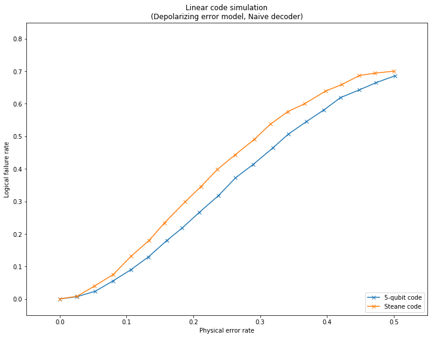

qecsim demos
============

Plotting logical failure rate as a function of physical error rate for linear stabilizer codes
----------------------------------------------------------------------------------------------

This demo shows how to plot statistics on many error correction
simulation runs, see figure for more details.

The code makes use of
``qecsim.app.run(code, error_model, decoder, error_probability, max_runs, max_failures)``.

Initialise run parameters
~~~~~~~~~~~~~~~~~~~~~~~~~

.. code:: ipython3

    %matplotlib inline
    import collections
    import itertools
    import numpy as np
    import matplotlib.pyplot as plt
    from qecsim import app
    from qecsim.models.generic import DepolarizingErrorModel, NaiveDecoder
    from qecsim.models.basic import FiveQubitCode, SteaneCode
    
    # set models
    codes = [FiveQubitCode(), SteaneCode()]
    error_model = DepolarizingErrorModel()
    decoder = NaiveDecoder()
    # set physical error probabilities
    error_probability_min, error_probability_max = 0, 0.5
    error_probabilities = np.linspace(error_probability_min, error_probability_max, 20)
    # set max_runs for each probability
    max_runs = 10000
    
    # print run parameters
    print('Codes:', [code.label for code in codes])
    print('Error model:', error_model.label)
    print('Decoder:', decoder.label)
    print('Error probabilities:', error_probabilities)
    print('Maximum runs:', max_runs)

.. parsed-literal::

    Codes: ['5-qubit', 'Steane']
    Error model: Depolarizing
    Decoder: Naive
    Error probabilities: [0.         0.02631579 0.05263158 0.07894737 0.10526316 0.13157895
     0.15789474 0.18421053 0.21052632 0.23684211 0.26315789 0.28947368
     0.31578947 0.34210526 0.36842105 0.39473684 0.42105263 0.44736842
     0.47368421 0.5       ]
    Maximum runs: 10000

Run simulations
~~~~~~~~~~~~~~~

.. code:: ipython3

    # run simulations and print data from middle run to view format
    data = [app.run(code, error_model, decoder, error_probability, max_runs=max_runs)
            for code in codes for error_probability in error_probabilities]
    print(data[len(data)//2])

.. parsed-literal::

    {'code': 'Steane', 'n_k_d': (7, 1, 3), 'time_steps': 1, 'error_model': 'Depolarizing', 'decoder': 'Naive', 'error_probability': 0.0, 'measurement_error_probability': 0.0, 'n_run': 10000, 'n_success': 10000, 'n_fail': 0, 'error_weight_total': 0, 'error_weight_pvar': 0, 'logical_failure_rate': 0.0, 'physical_error_rate': 0.0, 'wall_time': 4.385910160999998}

Prepare data for plotting
~~~~~~~~~~~~~~~~~~~~~~~~~

.. code:: ipython3

    # prepare code to x,y map and print
    code_to_xys = {}
    for run in data:
        xys = code_to_xys.setdefault(run['code'], [])
        xys.append((run['physical_error_rate'], run['logical_failure_rate']))
    print('\n'.join('{}: {}'.format(k, v) for k, v in code_to_xys.items()))

.. parsed-literal::

    5-qubit: [(0.0, 0.0), (0.02538, 0.0066), (0.05318, 0.0236), (0.07962000000000001, 0.0553), (0.10655999999999999, 0.0899), (0.1323, 0.1285), (0.16054000000000002, 0.18), (0.18328, 0.2182), (0.20922, 0.2667), (0.23772, 0.318), (0.26306, 0.3722), (0.2899, 0.4141), (0.31882, 0.4641), (0.34198, 0.5064), (0.36914, 0.5452), (0.39558000000000004, 0.5814), (0.42031999999999997, 0.6191), (0.44793999999999995, 0.6423), (0.47342, 0.6649), (0.5019600000000001, 0.6862)]
    Steane: [(0.0, 0.0), (0.025957142857142856, 0.008), (0.05231428571428571, 0.0401), (0.07984285714285715, 0.0747), (0.1066, 0.1309), (0.13392857142857142, 0.1803), (0.15657142857142858, 0.2335), (0.18775714285714287, 0.2986), (0.21158571428571427, 0.346), (0.2362, 0.3987), (0.2622285714285714, 0.4426), (0.2913, 0.4907), (0.3153714285714286, 0.5375), (0.34125714285714287, 0.5759), (0.3663571428571428, 0.6), (0.39808571428571426, 0.6393), (0.4218857142857143, 0.6588), (0.44854285714285713, 0.6869), (0.47174285714285713, 0.6941), (0.4999142857142857, 0.7002)]

Plot logical failure rate against physical error rate
~~~~~~~~~~~~~~~~~~~~~~~~~~~~~~~~~~~~~~~~~~~~~~~~~~~~~

.. code:: ipython3

    # format plot
    fig = plt.figure(1, figsize=(12, 9))
    plt.title('Linear code simulation\n({} error model, {} decoder)'.format(error_model.label, decoder.label))
    plt.xlabel('Physical error rate')
    plt.ylabel('Logical failure rate')
    plt.xlim(error_probability_min-0.05, error_probability_max+0.05)
    plt.ylim(-0.05, 0.85)
    # add data
    for code, xys in code_to_xys.items():
        plt.plot(*zip(*xys), 'x-', label='{} code'.format(code))
    plt.legend(loc='lower right')
    plt.show()

Fig. 1. Logical failure rate as a function of physical error rate for
linear stabilizer codes.

Definitions:

-  | A physical error occurs when the generated error acts non-trivially
     on a physical qubit.
   | :math:`(\text{physical error rate}) = mean(\text{error weight}) / (\text{number of physical qubits})`.

-  | A logical failure occurs when the combined action of the generated
     error and recovery operation acts non-trivially on the codespace,
     irrespective of the number of logical qubits encoded.
   | :math:`(\text{logical failure rate}) = (\text{number of logical failures}) / (\text{number of runs})`.
