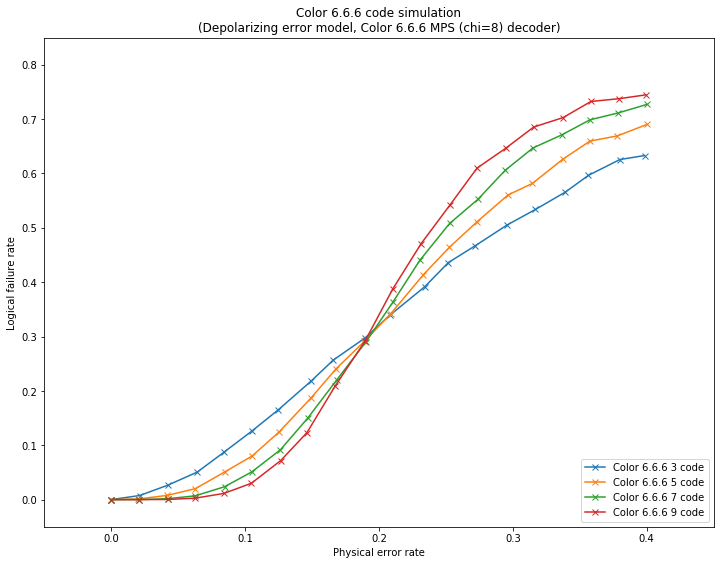

qecsim demos
============

Plotting logical failure rate as a function of physical error rate for color 6.6.6 stabilizer codes
---------------------------------------------------------------------------------------------------

This demo shows how to plot statistics on many error correction
simulation runs, see figure for more details.

The code makes use of
``qecsim.app.run(code, error_model, decoder, error_probability, max_runs, max_failures)``.

Initialise run parameters
~~~~~~~~~~~~~~~~~~~~~~~~~

.. code:: ipython3

    %matplotlib inline
    import collections
    import itertools
    import numpy as np
    import matplotlib.pyplot as plt
    from qecsim import app
    from qecsim.models.generic import DepolarizingErrorModel
    from qecsim.models.color import Color666Code, Color666MPSDecoder
    
    # set models
    codes = [Color666Code(size) for size in [3, 5, 7, 9]]
    error_model = DepolarizingErrorModel()
    decoder = Color666MPSDecoder(chi=8)
    # set physical error probabilities
    error_probability_min, error_probability_max = 0, 0.4
    error_probabilities = np.linspace(error_probability_min, error_probability_max, 20)
    # set max_runs for each probability
    max_runs = 10000
    
    # print run parameters
    print('Codes:', [code.label for code in codes])
    print('Error model:', error_model.label)
    print('Decoder:', decoder.label)
    print('Error probabilities:', error_probabilities)
    print('Maximum runs:', max_runs)

.. parsed-literal::

    Codes: ['Color 6.6.6 3', 'Color 6.6.6 5', 'Color 6.6.6 7', 'Color 6.6.6 9']
    Error model: Depolarizing
    Decoder: Color 6.6.6 MPS (chi=8)
    Error probabilities: [0.         0.02105263 0.04210526 0.06315789 0.08421053 0.10526316
     0.12631579 0.14736842 0.16842105 0.18947368 0.21052632 0.23157895
     0.25263158 0.27368421 0.29473684 0.31578947 0.33684211 0.35789474
     0.37894737 0.4       ]
    Maximum runs: 10000

Run simulations
~~~~~~~~~~~~~~~

.. code:: ipython3

    # run simulations and print data from middle run to view format
    data = [app.run(code, error_model, decoder, error_probability, max_runs=max_runs)
            for code in codes for error_probability in error_probabilities]
    print(data[len(data)//2])

.. parsed-literal::

    {'code': 'Color 6.6.6 7', 'n_k_d': (37, 1, 7), 'time_steps': 1, 'error_model': 'Depolarizing', 'decoder': 'Color 6.6.6 MPS (chi=8)', 'error_probability': 0.0, 'measurement_error_probability': 0.0, 'n_run': 10000, 'n_success': 10000, 'n_fail': 0, 'error_weight_total': 0, 'error_weight_pvar': 0, 'logical_failure_rate': 0.0, 'physical_error_rate': 0.0, 'wall_time': 188.2068080680001}

Prepare data for plotting
~~~~~~~~~~~~~~~~~~~~~~~~~

.. code:: ipython3

    # prepare code to x,y map and print
    code_to_xys = {}
    for run in data:
        xys = code_to_xys.setdefault(run['code'], [])
        xys.append((run['physical_error_rate'], run['logical_failure_rate']))
    print('\n'.join('{}: {}'.format(k, v) for k, v in code_to_xys.items()))

.. parsed-literal::

    Color 6.6.6 3: [(0.0, 0.0), (0.021314285714285713, 0.0075), (0.04242857142857143, 0.0266), (0.06441428571428572, 0.0507), (0.08425714285714285, 0.0871), (0.10495714285714286, 0.1257), (0.12497142857142858, 0.1654), (0.1496, 0.2185), (0.1659142857142857, 0.2567), (0.18992857142857142, 0.2978), (0.20844285714285715, 0.3397), (0.23434285714285716, 0.3918), (0.25188571428571427, 0.4361), (0.27212857142857144, 0.4673), (0.29588571428571425, 0.5054), (0.31694285714285714, 0.5338), (0.33914285714285713, 0.5656), (0.3565285714285714, 0.5966), (0.37997142857142857, 0.6256), (0.3984142857142857, 0.633)]
    Color 6.6.6 5: [(0.0, 0.0), (0.020494736842105264, 0.0012), (0.04198421052631579, 0.0078), (0.06298947368421053, 0.0202), (0.08472631578947369, 0.0507), (0.10528947368421052, 0.0801), (0.1256736842105263, 0.1249), (0.14922105263157895, 0.1867), (0.1679157894736842, 0.2403), (0.18915263157894738, 0.2911), (0.20901052631578945, 0.3423), (0.2331842105263158, 0.4137), (0.2526473684210526, 0.4641), (0.27315263157894737, 0.5108), (0.29631052631578947, 0.5602), (0.3146631578947368, 0.5817), (0.3373315789473684, 0.6262), (0.3576736842105263, 0.6596), (0.37805789473684215, 0.6691), (0.4001368421052632, 0.6901)]
    Color 6.6.6 7: [(0.0, 0.0), (0.021040540540540543, 0.0), (0.0424027027027027, 0.0017), (0.0628864864864865, 0.007), (0.08486216216216216, 0.0238), (0.10515135135135135, 0.0511), (0.1264891891891892, 0.0917), (0.14677837837837837, 0.1497), (0.1685054054054054, 0.2201), (0.19028648648648647, 0.29), (0.2102972972972973, 0.3627), (0.23056216216216216, 0.4402), (0.2528027027027027, 0.508), (0.2738918918918919, 0.5523), (0.2942864864864865, 0.6057), (0.3151027027027027, 0.647), (0.33642162162162165, 0.6708), (0.35764054054054056, 0.6987), (0.3789162162162162, 0.7115), (0.4002513513513513, 0.7271)]
    Color 6.6.6 9: [(0.0, 0.0), (0.020737704918032788, 0.0), (0.0425, 0.0003), (0.06274426229508197, 0.0027), (0.08413934426229508, 0.0113), (0.10481475409836066, 0.0301), (0.12664918032786887, 0.0717), (0.14628032786885248, 0.1232), (0.1673967213114754, 0.2091), (0.18985737704918032, 0.2925), (0.21024754098360654, 0.387), (0.2316032786885246, 0.4711), (0.25329836065573774, 0.5427), (0.2733049180327869, 0.6099), (0.2945737704918033, 0.6461), (0.3156032786885246, 0.6854), (0.33748852459016393, 0.7027), (0.3583377049180328, 0.7324), (0.3794819672131147, 0.7376), (0.3993934426229508, 0.7446)]

Plot logical failure rate against physical error rate
~~~~~~~~~~~~~~~~~~~~~~~~~~~~~~~~~~~~~~~~~~~~~~~~~~~~~

.. code:: ipython3

    # format plot
    fig = plt.figure(1, figsize=(12, 9))
    plt.title('Color 6.6.6 code simulation\n({} error model, {} decoder)'.format(error_model.label, decoder.label))
    plt.xlabel('Physical error rate')
    plt.ylabel('Logical failure rate')
    plt.xlim(error_probability_min-0.05, error_probability_max+0.05)
    plt.ylim(-0.05, 0.85)
    # add data
    for code, xys in code_to_xys.items():
        plt.plot(*zip(*xys), 'x-', label='{} code'.format(code))
    plt.legend(loc='lower right')
    plt.show()

Fig. 1. Logical failure rate as a function of physical error rate for
color 6.6.6 stabilizer codes.

Definitions:

-  | A physical error occurs when the generated error acts non-trivially
     on a physical qubit.
   | :math:`(\text{physical error rate}) = mean(\text{error weight}) / (\text{number of physical qubits})`.

-  | A logical failure occurs when the combined action of the generated
     error and recovery operation acts non-trivially on the codespace,
     irrespective of the number of logical qubits encoded.
   | :math:`(\text{logical failure rate}) = (\text{number of logical failures}) / (\text{number of runs})`.
