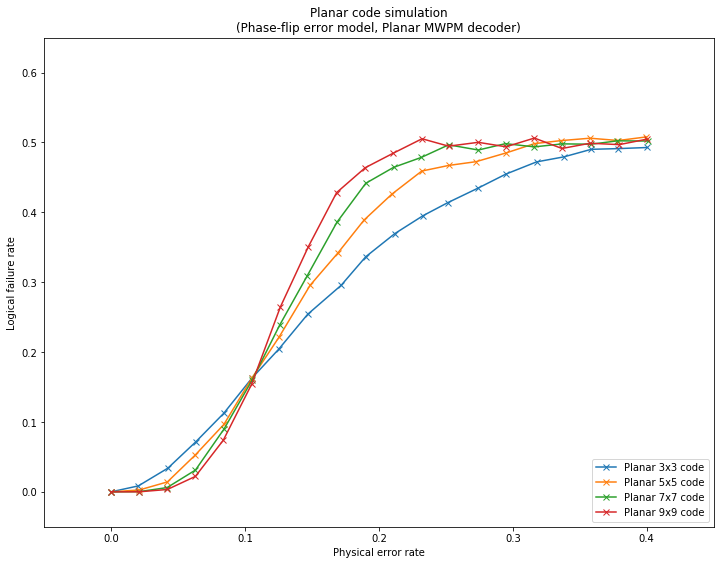

qecsim demos
============

Plotting logical failure rate as a function of physical error rate for planar stabilizer codes
----------------------------------------------------------------------------------------------

This demo shows how to plot statistics on many error correction
simulation runs, see figure for more details.

The code makes use of
``qecsim.app.run(code, error_model, decoder, error_probability, max_runs, max_failures)``.

Initialise run parameters
~~~~~~~~~~~~~~~~~~~~~~~~~

.. code:: ipython3

    %matplotlib inline
    import collections
    import itertools
    import numpy as np
    import matplotlib.pyplot as plt
    from qecsim import app
    from qecsim.models.generic import PhaseFlipErrorModel
    from qecsim.models.planar import PlanarCode, PlanarMWPMDecoder
    
    # set models
    codes = [PlanarCode(*size) for size in [(3, 3), (5, 5), (7, 7), (9, 9)]]
    error_model = PhaseFlipErrorModel()
    decoder = PlanarMWPMDecoder()
    # set physical error probabilities
    error_probability_min, error_probability_max = 0, 0.4
    error_probabilities = np.linspace(error_probability_min, error_probability_max, 20)
    # set max_runs for each probability
    max_runs = 10000
    
    # print run parameters
    print('Codes:', [code.label for code in codes])
    print('Error model:', error_model.label)
    print('Decoder:', decoder.label)
    print('Error probabilities:', error_probabilities)
    print('Maximum runs:', max_runs)

.. parsed-literal::

    Codes: ['Planar 3x3', 'Planar 5x5', 'Planar 7x7', 'Planar 9x9']
    Error model: Phase-flip
    Decoder: Planar MWPM
    Error probabilities: [0.         0.02105263 0.04210526 0.06315789 0.08421053 0.10526316
     0.12631579 0.14736842 0.16842105 0.18947368 0.21052632 0.23157895
     0.25263158 0.27368421 0.29473684 0.31578947 0.33684211 0.35789474
     0.37894737 0.4       ]
    Maximum runs: 10000

Run simulations
~~~~~~~~~~~~~~~

.. code:: ipython3

    # run simulations and print data from middle run to view format
    data = [app.run(code, error_model, decoder, error_probability, max_runs=max_runs)
            for code in codes for error_probability in error_probabilities]
    print(data[len(data)//2])

.. parsed-literal::

    {'code': 'Planar 7x7', 'n_k_d': (85, 1, 7), 'time_steps': 1, 'error_model': 'Phase-flip', 'decoder': 'Planar MWPM', 'error_probability': 0.0, 'measurement_error_probability': 0.0, 'n_run': 10000, 'n_success': 10000, 'n_fail': 0, 'error_weight_total': 0, 'error_weight_pvar': 0, 'logical_failure_rate': 0.0, 'physical_error_rate': 0.0, 'wall_time': 18.8377434680001}

Prepare data for plotting
~~~~~~~~~~~~~~~~~~~~~~~~~

.. code:: ipython3

    # prepare code to x,y map and print
    code_to_xys = {}
    for run in data:
        xys = code_to_xys.setdefault(run['code'], [])
        xys.append((run['physical_error_rate'], run['logical_failure_rate']))
    print('\n'.join('{}: {}'.format(k, v) for k, v in code_to_xys.items()))

.. parsed-literal::

    Planar 3x3: [(0.0, 0.0), (0.020376923076923077, 0.0085), (0.04244615384615385, 0.0339), (0.06314615384615385, 0.0713), (0.08421538461538462, 0.1125), (0.10518461538461538, 0.1627), (0.12524615384615387, 0.2042), (0.1468, 0.254), (0.17186923076923077, 0.2956), (0.1902, 0.3364), (0.21196923076923077, 0.3696), (0.23303076923076924, 0.3952), (0.2512615384615385, 0.4136), (0.2741769230769231, 0.4347), (0.2947923076923077, 0.4546), (0.31774615384615384, 0.4721), (0.3381076923076923, 0.4793), (0.35857692307692307, 0.4901), (0.3784692307692308, 0.4911), (0.4005230769230769, 0.4927)]
    Planar 5x5: [(0.0, 0.0), (0.021153658536585365, 0.0027), (0.04207073170731707, 0.0142), (0.06267317073170732, 0.0523), (0.08428536585365853, 0.0965), (0.10525365853658536, 0.163), (0.12549024390243904, 0.2215), (0.14862926829268291, 0.2955), (0.1693560975609756, 0.3417), (0.18898536585365852, 0.389), (0.2097243902439024, 0.426), (0.23202195121951216, 0.459), (0.2523170731707317, 0.4671), (0.2725073170731707, 0.4724), (0.2952780487804878, 0.4851), (0.31633170731707316, 0.4983), (0.3362390243902439, 0.5026), (0.3576731707317073, 0.506), (0.3787609756097561, 0.5027), (0.3996, 0.5078)]
    Planar 7x7: [(0.0, 0.0), (0.020943529411764705, 0.0003), (0.041849411764705885, 0.0061), (0.06304, 0.0312), (0.08437176470588235, 0.0899), (0.10522470588235294, 0.1595), (0.12592823529411765, 0.2386), (0.14631882352941178, 0.3085), (0.16866235294117646, 0.3857), (0.1902129411764706, 0.4415), (0.21099058823529412, 0.4643), (0.23165882352941175, 0.4785), (0.2520835294117647, 0.4965), (0.2742423529411765, 0.4891), (0.2945717647058823, 0.4982), (0.31610941176470586, 0.4936), (0.3369682352941176, 0.4979), (0.35838705882352945, 0.4974), (0.3780823529411765, 0.5022), (0.4012858823529412, 0.502)]
    Planar 9x9: [(0.0, 0.0), (0.02117241379310345, 0.0001), (0.04204068965517241, 0.0034), (0.06298344827586207, 0.0221), (0.08383448275862068, 0.0739), (0.10494068965517242, 0.1538), (0.12643517241379312, 0.2645), (0.14736689655172414, 0.3509), (0.16846620689655173, 0.4282), (0.1898193103448276, 0.4638), (0.21077172413793105, 0.4846), (0.23222413793103447, 0.5052), (0.25206206896551725, 0.4946), (0.27421103448275863, 0.5001), (0.29489931034482764, 0.4937), (0.31612758620689657, 0.5062), (0.3366724137931034, 0.4913), (0.35776206896551727, 0.4988), (0.3794165517241379, 0.4968), (0.4000496551724138, 0.5046)]

Plot logical failure rate against physical error rate
~~~~~~~~~~~~~~~~~~~~~~~~~~~~~~~~~~~~~~~~~~~~~~~~~~~~~

.. code:: ipython3

    # format plot
    fig = plt.figure(1, figsize=(12, 9))
    plt.title('Planar code simulation\n({} error model, {} decoder)'.format(error_model.label, decoder.label))
    plt.xlabel('Physical error rate')
    plt.ylabel('Logical failure rate')
    plt.xlim(error_probability_min-0.05, error_probability_max+0.05)
    plt.ylim(-0.05, 0.65)
    # add data
    for code, xys in code_to_xys.items():
        plt.plot(*zip(*xys), 'x-', label='{} code'.format(code))
    plt.legend(loc='lower right')
    plt.show()

Fig. 1. Logical failure rate as a function of physical error rate for
planar stabilizer codes.

Definitions:

-  | A physical error occurs when the generated error acts non-trivially
     on a physical qubit.
   | :math:`(\text{physical error rate}) = mean(\text{error weight}) / (\text{number of physical qubits})`.

-  | A logical failure occurs when the combined action of the generated
     error and recovery operation acts non-trivially on the codespace,
     irrespective of the number of logical qubits encoded.
   | :math:`(\text{logical failure rate}) = (\text{number of logical failures}) / (\text{number of runs})`.
