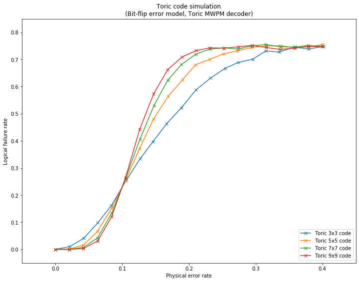

qecsim demos
============

Plotting logical failure rate as a function of physical error rate for toric stabilizer codes
---------------------------------------------------------------------------------------------

This demo shows how to plot statistics on many error correction
simulation runs, see figure for more details.

The code makes use of
``qecsim.app.run(code, error_model, decoder, error_probability, max_runs, max_failures)``.

Initialise run parameters
~~~~~~~~~~~~~~~~~~~~~~~~~

.. code:: ipython3

    %matplotlib inline
    import collections
    import itertools
    import numpy as np
    import matplotlib.pyplot as plt
    from qecsim import app
    from qecsim.models.generic import BitFlipErrorModel
    from qecsim.models.toric import ToricCode, ToricMWPMDecoder
    
    # set models
    codes = [ToricCode(*size) for size in [(3, 3), (5, 5), (7, 7), (9, 9)]]
    error_model = BitFlipErrorModel()
    decoder = ToricMWPMDecoder()
    # set physical error probabilities
    error_probability_min, error_probability_max = 0, 0.4
    error_probabilities = np.linspace(error_probability_min, error_probability_max, 20)
    # set max_runs for each probability
    max_runs = 10000
    
    # print run parameters
    print('Codes:', [code.label for code in codes])
    print('Error model:', error_model.label)
    print('Decoder:', decoder.label)
    print('Error probabilities:', error_probabilities)
    print('Maximum runs:', max_runs)

.. parsed-literal::

    Codes: ['Toric 3x3', 'Toric 5x5', 'Toric 7x7', 'Toric 9x9']
    Error model: Bit-flip
    Decoder: Toric MWPM
    Error probabilities: [0.         0.02105263 0.04210526 0.06315789 0.08421053 0.10526316
     0.12631579 0.14736842 0.16842105 0.18947368 0.21052632 0.23157895
     0.25263158 0.27368421 0.29473684 0.31578947 0.33684211 0.35789474
     0.37894737 0.4       ]
    Maximum runs: 10000

Run simulations
~~~~~~~~~~~~~~~

.. code:: ipython3

    # run simulations and print data from middle run to view format
    data = [app.run(code, error_model, decoder, error_probability, max_runs=max_runs)
            for code in codes for error_probability in error_probabilities]
    print(data[len(data)//2])

.. parsed-literal::

    {'code': 'Toric 7x7', 'n_k_d': (98, 2, 7), 'time_steps': 1, 'error_model': 'Bit-flip', 'decoder': 'Toric MWPM', 'error_probability': 0.0, 'measurement_error_probability': 0.0, 'n_run': 10000, 'n_success': 10000, 'n_fail': 0, 'error_weight_total': 0, 'error_weight_pvar': 0, 'logical_failure_rate': 0.0, 'physical_error_rate': 0.0, 'wall_time': 17.376716869000006}

Prepare data for plotting
~~~~~~~~~~~~~~~~~~~~~~~~~

.. code:: ipython3

    # prepare code to x,y map and print
    code_to_xys = {}
    for run in data:
        xys = code_to_xys.setdefault(run['code'], [])
        xys.append((run['physical_error_rate'], run['logical_failure_rate']))
    print('\n'.join('{}: {}'.format(k, v) for k, v in code_to_xys.items()))

.. parsed-literal::

    Toric 3x3: [(0.0, 0.0), (0.021822222222222222, 0.0106), (0.04238888888888889, 0.0408), (0.06358333333333334, 0.0978), (0.08384444444444444, 0.1615), (0.10636666666666668, 0.2553), (0.1268111111111111, 0.3336), (0.14600555555555556, 0.3967), (0.1664, 0.4626), (0.1887222222222222, 0.5219), (0.21083888888888888, 0.5883), (0.2325722222222222, 0.6315), (0.25423333333333337, 0.6673), (0.27373333333333333, 0.6888), (0.2955611111111111, 0.701), (0.3151333333333333, 0.7312), (0.33502777777777776, 0.7273), (0.35812777777777777, 0.7455), (0.37923888888888885, 0.7383), (0.4015666666666666, 0.7483)]
    Toric 5x5: [(0.0, 0.0), (0.021118, 0.0017), (0.041906, 0.0154), (0.063106, 0.0667), (0.084676, 0.1522), (0.10512, 0.2552), (0.125952, 0.3707), (0.14678, 0.4793), (0.168784, 0.5635), (0.19005, 0.6239), (0.20979, 0.6801), (0.231542, 0.701), (0.252048, 0.7206), (0.272854, 0.732), (0.294548, 0.7439), (0.31587800000000005, 0.7497), (0.336758, 0.7507), (0.357688, 0.7433), (0.38028, 0.7467), (0.40012, 0.7551)]
    Toric 7x7: [(0.0, 0.0), (0.021237755102040817, 0.0001), (0.04196224489795918, 0.0073), (0.0631, 0.0425), (0.08456326530612245, 0.1342), (0.10490408163265307, 0.2612), (0.12672551020408163, 0.4064), (0.14762551020408163, 0.53), (0.16836938775510205, 0.6236), (0.188834693877551, 0.6812), (0.21030306122448977, 0.7192), (0.23164489795918367, 0.7382), (0.25269795918367344, 0.7425), (0.2738663265306122, 0.7384), (0.29432448979591835, 0.7504), (0.31499795918367346, 0.7549), (0.3371622448979592, 0.7465), (0.3588081632653061, 0.7457), (0.37846632653061224, 0.7514), (0.3991387755102041, 0.7485)]
    Toric 9x9: [(0.0, 0.0), (0.02106358024691358, 0.0001), (0.04199691358024691, 0.0031), (0.06323086419753086, 0.0307), (0.08423333333333334, 0.1198), (0.1050888888888889, 0.2646), (0.12642345679012346, 0.4433), (0.14725617283950618, 0.5735), (0.16824382716049383, 0.6624), (0.18975617283950616, 0.7089), (0.2108796296296296, 0.7324), (0.2316277777777778, 0.7429), (0.25207716049382717, 0.7415), (0.2736827160493827, 0.7463), (0.29478456790123453, 0.7518), (0.31619259259259264, 0.7438), (0.33661543209876543, 0.7369), (0.3580635802469136, 0.7416), (0.37859876543209875, 0.7482), (0.4000888888888889, 0.7471)]

Plot logical failure rate against physical error rate
~~~~~~~~~~~~~~~~~~~~~~~~~~~~~~~~~~~~~~~~~~~~~~~~~~~~~

.. code:: ipython3

    # format plot
    fig = plt.figure(1, figsize=(12, 9))
    plt.title('Toric code simulation\n({} error model, {} decoder)'.format(error_model.label, decoder.label))
    plt.xlabel('Physical error rate')
    plt.ylabel('Logical failure rate')
    plt.xlim(error_probability_min-0.05, error_probability_max+0.05)
    plt.ylim(-0.05, 0.85)
    # add data
    for code, xys in code_to_xys.items():
        plt.plot(*zip(*xys), 'x-', label='{} code'.format(code))
    plt.legend(loc='lower right')
    plt.show()

Fig. 1. Logical failure rate as a function of physical error rate for
toric stabilizer codes.

Definitions:

-  | A physical error occurs when the generated error acts non-trivially
     on a physical qubit.
   | :math:`(\text{physical error rate}) = mean(\text{error weight}) / (\text{number of physical qubits})`.

-  | A logical failure occurs when the combined action of the generated
     error and recovery operation acts non-trivially on the codespace,
     irrespective of the number of logical qubits encoded.
   | :math:`(\text{logical failure rate}) = (\text{number of logical failures}) / (\text{number of runs})`.
